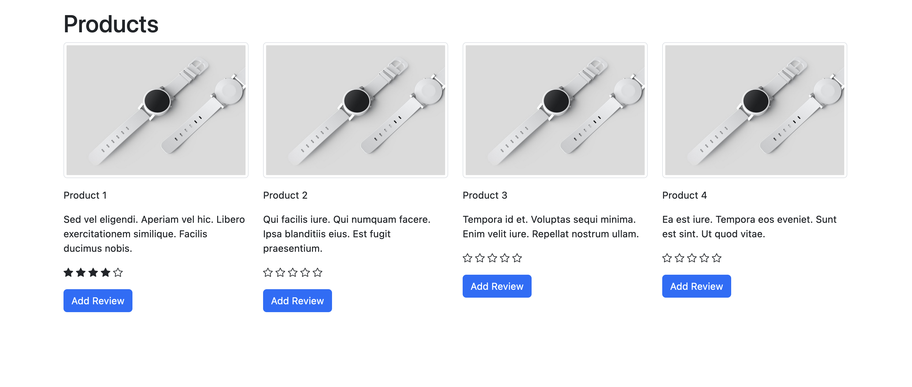

# Product Review App



### Ruby Version
This app is using ruby 3.0.5

### Development Setup

Run the following commands.

```
bundle install
rails db:create
rails db:migrate
rails db:seed
```
### Development

Run the web server.

`rails s`

### Testing

Run RSpec tests.

`RAILS_ENV=test bundle exec rspec`

### API Endpoints

GET Request list products example:
```
curl --location 'localhost:3000/api/products'
```

POST Request create reviews example:
```
curl --location 'localhost:3000/api/reviews' \
--header 'Content-Type: application/json' \
--data '{
    "review": {
        "product_id": 1,
        "reviewer_name": "mike",
        "body": "test",
        "rating": "4"
    }
}'
```
